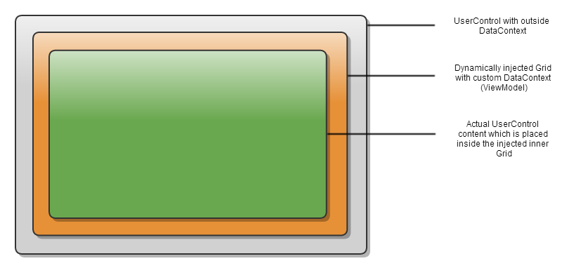

# BindingErrorRepro

This repro shows the binding errors that occur when using Catel in WPF.

## How Catel works

Catel uses a "double" or "replicated" DataContext strategy. This allows a user control to have an "external" and "internal" data context, enabling the opportunity to have any data context, that can be converted into an internal data context without breaking the outer one.

The reason Catel uses this approach is to allow "model injection" and dynamic view model creation. For example, if a PersonView has a data context of   `Person`, it can automatically be converted to `PersonViewModel` without breaking the data context binding on the user control itself.
 
Catel achieves this by adding / injecting a root grid to a user control. This means that the UserControl will keep its data context, but the internal controls inside the user control can use the view model that belongs to this user control:



Below is an example where this is extremely useful:

* FamilyView (outside DC is null, inside DC is FamilyViewModel)
  * PersonView (outside DC is Person, inside DC is PersonViewModel)
  * PersonView (outside DC is Person, inside DC is PersonViewModel)
  * PersonView (outside DC is Person, inside DC is PersonViewModel)


For more information, see http://docs.catelproject.com/vnext/catel-mvvm/views/xaml/advanced/usercontrol-under-the-hood/

## Issue described

Because the DataContext is updated from `Person` to `PersonViewModel`, WPF will first try to bind to the `Person` model. But this model does not have all the properties are exposed by the `PersonViewModel`, thus causing binding errors as shown below:

```
System.Windows.Data Error: 40 : BindingExpression path error: 'NonExistingProperty' property not found on 'object' ''PersonViewModel' (HashCode=54269597)'. BindingExpression:Path=NonExistingProperty; DataItem='PersonViewModel' (HashCode=54269597); target element is 'Label' (Name=''); target property is 'Content' (type 'Object')
```